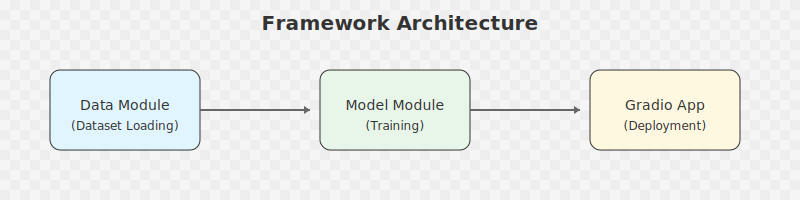

# Generic Image Classification Framework

**What is this?** A user-friendly tool that helps you teach a computer to recognize and categorize images automatically - no programming knowledge required!



## What Can This Do For You?

This tool allows you to:

- **Automatically categorize images**: Train a computer to sort images into different categories (like "normal" vs. "abnormal" medical scans)
- **Use your own image categories**: The system learns from your own labeled examples
- **Apply expert knowledge**: You provide the labeled examples, the system learns the patterns
- **Get immediate results**: Test your trained system on new images instantly
- **No coding required**: Everything works through a simple interface


## Simple Explanation of How It Works

1. **You provide categorized images**: For example, folders of "normal tissue" and "abnormal tissue" images
2. **The system learns patterns**: The AI studies what makes each category unique
3. **The system can then identify new images**: After learning, it can categorize images it's never seen before

## Getting Started (Technical Instructions)

### Installation

Install the required software:

```bash
pip install -r requirements.txt
```

For development purposes:

```bash
pip install -r requirements-dev.txt
```

### Basic Usage

The simplest way to use the framework:

```bash
python app.py
```

This will:
1. Guide you to provide a dataset of categorized images
2. Train a model to recognize patterns in your images
3. Launch a friendly interface for testing the trained model

### How to Prepare Your Images

Your images should be organized in folders, with each folder representing a category:

```
dataset.zip
├── normal/
│   ├── image1.jpg
│   ├── image2.jpg
│   └── ...
├── abnormal/
│   ├── image1.jpg
│   ├── image2.jpg
│   └── ...
└── ...
```

Each folder name becomes a category the system will learn to identify.

## Understanding the AI Models

The system can use different "models" (AI engines) depending on your needs. Think of these as different brains with various capabilities:


- **Fast, lightweight models** (like MobileNetV2): Great for starting out or when you need quick results
- **Medium-sized models** (like ResNet50): Good balance between accuracy and speed
- **Powerful models** (like ResNet152): When you need the highest possible accuracy

## How Data Flows Through the System

This diagram shows how your images move through the system - from input to results:


1. **Your images** are loaded from a zip file
2. **Data Loading**: The system organizes your images into categories
3. **Preprocessing**: Images are standardized to work with the AI
4. **Model Training**: The AI learns patterns from your images
5. **Model Saving**: The trained AI is saved for future use
6. **Application**: A user interface lets you test new images

## Advanced Options

If you want more control, you can customize settings:

```bash
python app.py --help
```

Common settings you can adjust:

- Which AI model to use
- How long to train the system
- Image size and quality settings
- Where to save your trained model

### Using a Configuration File

For even more control, you can save all your settings in a configuration file:

```bash
python app.py --config path/to/config.json
```

## Practical Examples

### Training with Your Images

```bash
python app.py --zip your_images.zip --model resnet50 --epochs 20
```

### Testing Only (Skip Training)

```bash
python app.py --config your_settings.json --mode app
```

### Training Only (Skip Testing Interface)

```bash
python app.py --zip your_images.zip --mode train
```

## Potential Medical Applications

This tool could be useful for:

- Classifying medical images (X-rays, scans, microscope images)
- Sorting tissue samples based on visual characteristics
- Pre-screening large image datasets to flag potential areas of interest
- Educational tools for medical students learning pattern recognition

## License

This project is licensed under the MIT License - see the LICENSE file for details.